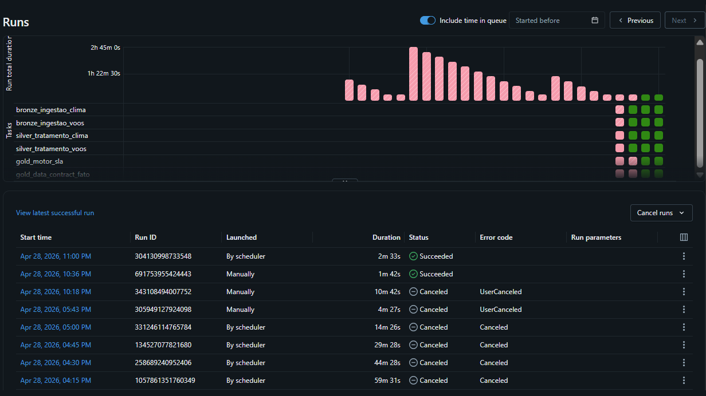
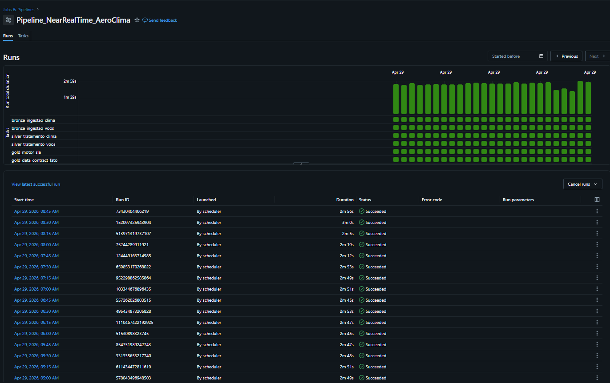
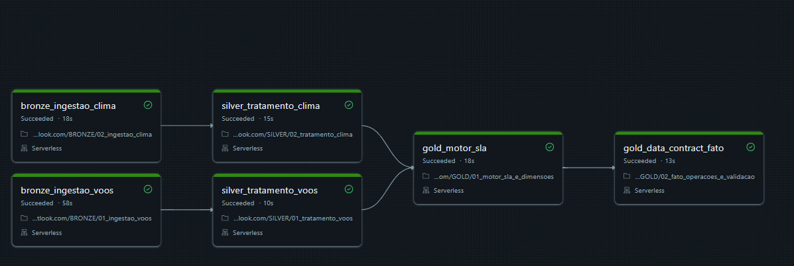

# Aero Clima — Pipeline de Dados Near Real-Time

**Data Engineering | Databricks, PySpark, Delta Lake e Power BI**

## Visão Geral

O Aero Clima é um pipeline de dados desenvolvido para monitoramento de Nível de Serviço (SLA) e risco operacional em aeroportos estratégicos: Congonhas (CGH), Guarulhos (GRU) e Porto Alegre (POA).

A solução integra dados de tráfego aéreo (OpenSky Network) com métricas meteorológicas em tempo quase real (OpenWeatherMap), permitindo a geração de indicadores operacionais voltados à tomada de decisão.

O pipeline foi estruturado seguindo princípios de engenharia de dados moderna, com separação por camadas, validação de qualidade e modelagem orientada ao consumo analítico.

---

## Engenharia de Performance e Otimização (Destaque)

O projeto passou por uma refatoração com foco em eficiência operacional, previsibilidade de processamento e redução de custo computacional.

Foram aplicadas as seguintes melhorias:

* Remoção do uso de `mergeSchema`, evitando overhead de metadados em Delta Lake
* Implementação de escrita em modo `append` estrito
* Aplicação de tipagem forte nas transformações
* Redução de reprocessamento desnecessário

**Resultado:** O tempo de processamento foi reduzido de aproximadamente **165 minutos** para **menos de 2 minutos**, mantendo consistência e integridade dos dados.

---

### Monitoramento e Estabilidade (Near Real-Time)

Após a estabilização, o pipeline opera de forma contínua e previsível, com execuções automatizadas a cada 15 minutos.

O fluxo apresenta alta taxa de sucesso nas etapas de ingestão, transformação e validação, garantindo disponibilidade dos dados para consumo analítico.

---

## Orquestração e Arquitetura de Dados

O pipeline segue o padrão **Medallion Architecture (Bronze, Silver, Gold)**, com orquestração via *Databricks Workflows*.

A ingestão dos domínios de dados (Voos e Clima) é executada de forma paralela, otimizando o uso de recursos computacionais e reduzindo o tempo total de processamento.

### Camadas do Lakehouse:

* **Bronze:** Ingestão de dados brutos em formato JSON, com autenticação OAuth2 (OpenSky) e persistência em Volumes do Unity Catalog.
* **Silver:** Padronização, tipagem forte, validação de schema e normalização de estruturas aninhadas.
* **Gold:** Integração entre domínios, aplicação de geofencing e execução do motor de regras de negócio.
* **Serving (Star Schema):** Construção da tabela fato com validação de **Data Contract**, garantindo estabilidade e compatibilidade para consumo em BI.

---

## Decisões de Arquitetura

### Separação em Camadas (Medallion)

A adoção do padrão Medallion permite isolar responsabilidades entre ingestão, transformação e consumo, reduzindo acoplamento e facilitando manutenção e evolução do pipeline.

### Uso de Append-Only nas Escritas

A escolha por cargas em modo append elimina reprocessamentos desnecessários e reduz o custo de escrita em Delta Lake, além de garantir previsibilidade de performance.

### Remoção de mergeSchema

A remoção dessa configuração foi fundamental para evitar overhead de metadados em tabelas Delta, especialmente em cenários com alta frequência de escrita.

### Data Contract na Camada Gold

A validação explícita do schema antes da carga na tabela fato foi implementada para garantir estabilidade no consumo por ferramentas de BI, evitando que alterações estruturais impactem dashboards.

### Tipagem Forte na Camada Silver

A aplicação de tipos explícitos reduz ambiguidades nos dados e melhora a confiabilidade das transformações e integrações subsequentes.

### Geofencing Simplificado

Foi adotada uma abordagem baseada em latitude para classificação de proximidade de aeroportos, priorizando simplicidade e performance. A evolução prevista inclui cálculo de distância geográfica mais preciso.

### Surrogate Key Determinística

A geração de identificadores únicos via hash (SHA-256) garante idempotência nas cargas e evita duplicidade na tabela fato.

---

## Regras de Negócio e Compliance

O motor de análise operacional classifica o risco com base em limites técnicos por aeroporto e condições meteorológicas.

* **Risco ALTO:**

  * Velocidade do vento acima dos limites operacionais (9 a 13 m/s, dependendo do aeroporto)
  * Condições severas como tempestade, neve ou eventos extremos

* **Risco MÉDIO:**

  * Velocidade do vento acima de limites intermediários (6 a 9 m/s)
  * Condições de baixa visibilidade (nevoeiro, chuva, névoa)

A classificação de risco é traduzida em indicadores de SLA, permitindo monitoramento operacional estruturado.

---

## Data Contract e Camada de Consumo

A camada final implementa validação explícita de contrato de dados antes da carga na tabela fato.

Isso garante:

* Estabilidade do schema para ferramentas de BI
* Prevenção de quebras em dashboards
* Consistência entre execuções do pipeline

A tabela `fato_operacoes` é projetada para consumo direto em ferramentas como Power BI, contendo dados integrados de voo, clima, risco e SLA.

---

## Stack Técnico

* **Linguagem:** Python e PySpark
* **Ambiente:** Databricks (Serverless Compute)
* **Armazenamento:** Delta Lake (transações ACID)
* **Orquestração:** Databricks Workflows
* **Consumo:** Power BI via Databricks SQL Warehouse

---

## Estrutura do Repositório

* `/notebooks/BRONZE`: Ingestão de dados e autenticação com APIs externas
* `/notebooks/SILVER`: Transformações, validações e padronização
* `/notebooks/GOLD`: Regras de negócio, SLA e validação de Data Contract
* `/legacy_local_ingestion`: Versão inicial do projeto (execução local)

---

## Evolução e Roadmap

* [x] **Arquitetura Medallion:** Separação em camadas Bronze, Silver e Gold
* [x] **Performance:** Redução de latência superior a 95%
* [x] **Data Quality:** Validação de schema e Data Contract na camada final
* [x] **Integração Multi-Fonte:** Dados de voo e clima correlacionados
* [ ] **Geofencing Avançado:** Implementação da fórmula de Haversine
* [ ] **Observabilidade:** Integração com alertas reais (Slack/Teams via Webhook)
